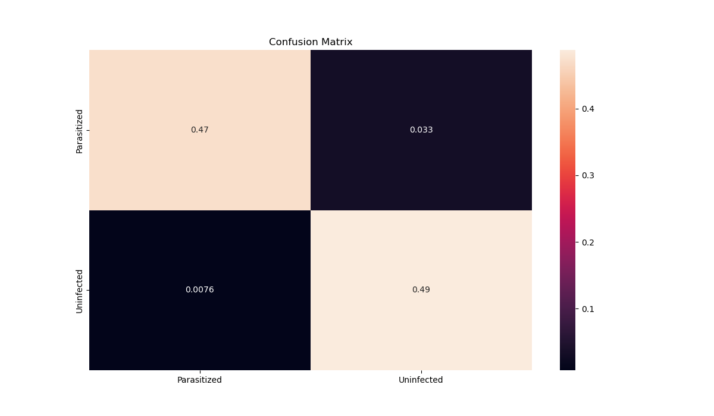

# malaria-detection-using-resNet

## This repository contains neural network models to classify/detect malaria cells as infected/unaffected  

## First, a simple convolution neural network is built to classify the data. Next, resNet18 and resNet50 models are implemented to compare accuracies of all the three models.  


### Dependencies

- ubuntu 20.04 LTS or latest
- pyTorch (torchvision, tensorboard)
- PIL
- tqdm
- sklearn (metrics)
  
### Setting up the Project

- Clone the git repository
```
git clone https://github.com/Madhunc5229/malaria-detection-using-resNet.git
```
- cd into the directory
```
cd malaria-detection-using-resNet
```
- Download the data folder google drive and extract the folder and **delete the .zip file after extracting**
https://drive.google.com/file/d/11Dpc8xlszRcO4feseaheV-QVsPJu6Nd6/view?usp=share_link

### Training the models
- There are three models on which the data has been trained. First one is simple convolution neural network called `convNet`, second is `resNet18` and theird is `resNet50`. 
- To train the models yourself, please follow the instructions (please note, if you train the model then the existing model will be overwritten)
- To train the convNet model:
```
python3 train.py convNet
```
- To train the resNet18 model:
```
python3 train.py resNet18
```
- To train the resNet50 model:
```
python3 train.py resNet50
```
### Testing the models:
- `test.py` is present to help vizualize the results from each model. When this file is executed, 6 images(3 infected, 3 unaffected) will be passed to the model the ouput will be printed on the terminal. If the classification is correct the output will be green in color, if not, it will be red in color.
- To test `convNet` model:
```
python3 test.py convNet
```
- To test `resNet18` model:
```
python3 test.py resNet18
```
- To test `resNet50` model:
```
python3 test.py resNet50
```

### Metrics for the models
- `metric.py` file helps in evaluating each model by computing the confusion matric for outputs of each model
- To see the confusion matrix for `convNet` model:
```
python3 metrics.py convNet
```
- To see the confusion matrix for `resNet18` model:
```
python3 metrics.py resNet18
```
- To see the confusion matrix for `resNet50` model:
```
python3 metrics.py resNet50
```
### Results

- The results are present in the `results` folder
- To vizualize the tensorboard plots, type the following command in terminal and click on the link `http://localhost:6006/`
```
tensorboard --logdir runs/
```
  
#### Resutls for convNet:  

- Loss:  


- Accuracy: 


- Confusion Matrix:


#### Resutls for resNet18:  

- Loss:  


- Accuracy: 


- Confusion Matrix:


#### Resutls for resNet50:  

- Loss:  


- Accuracy: 


- Confusion Matrix:


### Model Comparison:

- Loss:  


- Accuracy:  


